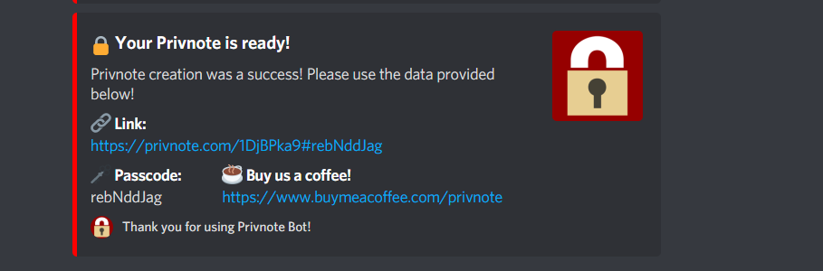

# 🔒 Welcome to Privnote bot!
## The best Privnote intergrated Discord Bot.

# How to Host it on your own:
1) Download ZIP and Extract!
2) Install NPM Modules by doing ``npm i``!
3) Make a ``.env`` file and add ``TOKEN=your-discord-bot-token``
4) Run ``npm start`` and you are good to go! 🥳

## For any issues please contact me via Discord: Tolba#0612
## Or open an issue.
